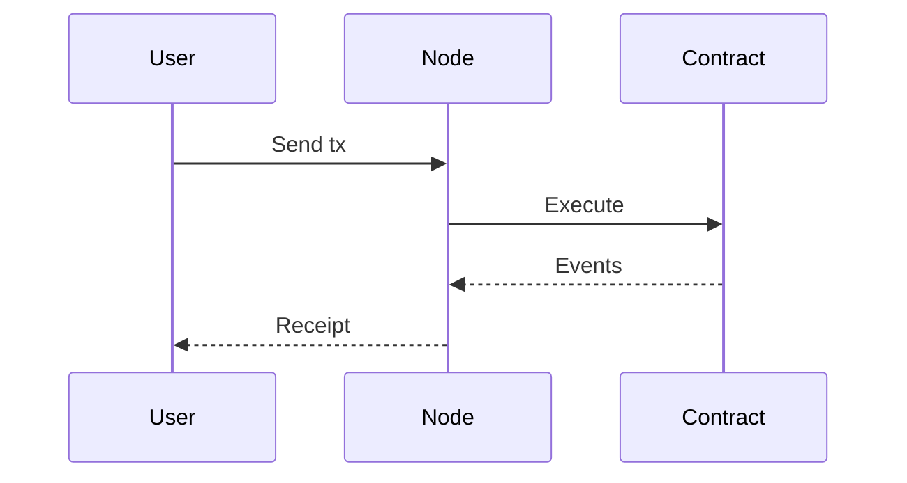

# Developer Walkthrough

End-to-end guide to build and deploy.

> Last updated: 2025-08-20

## Set Up SDK

```bash
npm install
npm test
```

## Deploy Sample Contract

```bash
npm run deploy:sample
```

## Call Contract

```bash
node scripts/call-sample.js
```

## Subscribe to Events

```javascript
const ws = new WebSocket('wss://ws.testnet.dytallix.example');
ws.onmessage = (m) => console.log(m.data);
```



Next: [Smart Contracts](smart-contracts.md)
