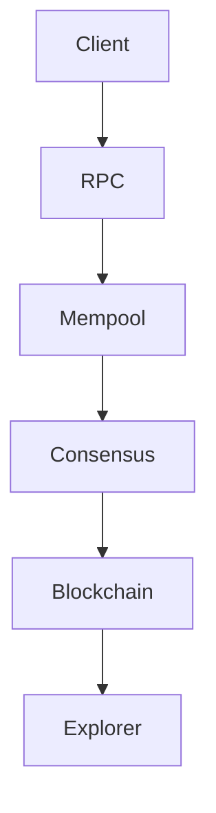

# Network Architecture

Overview of components and data flow.

> Last updated: 2025-08-20

Components:

- Nodes
- Consensus
- Mempool
- RPC
- PQC layer
- Faucet
- Explorer
- AI modules

See [Parameters](parameters.md) and [PQC Primer](pqc-primer.md).

Next: [PQC Primer](pqc-primer.md)
